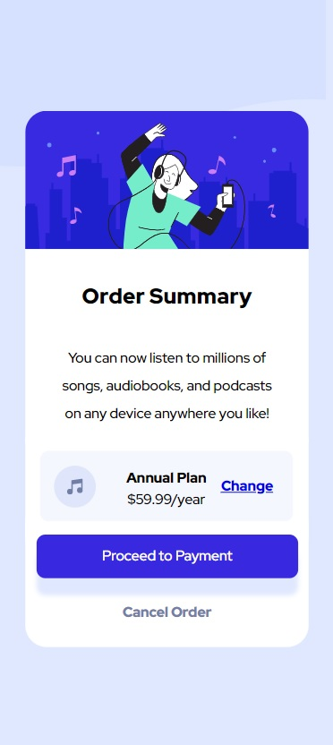

- Overview:
  - [Order Summary Component](#the-challenge)
  - [https://wella4life.github.io/Challenge.Order-Summary-Component/](#links)
  - 
  - 

 - Users should be able to:
   - View the optimal layout for the site depending on their device's screen size
   - Stats to Hover on : "Change Order" "Proceed to Payment" "Cancel Order"

 - What I Learned:
   - Grid and Flex can be used together
   - Grid and Flex sometimes help each other
   - Always have a Container for your entire project
   - Have the same Container for each section
   - Write Container code in Global Rules for easier access
